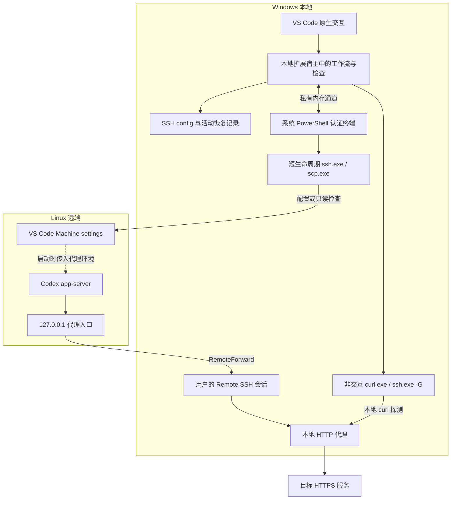
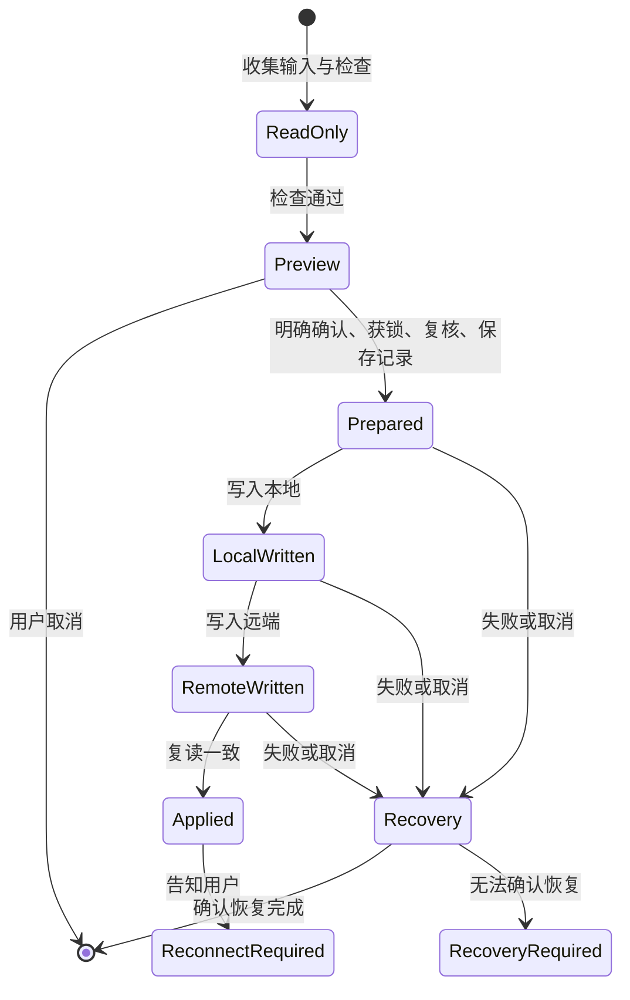

# v0.2 技术架构：本地 VS Code 扩展与原生 SSH 交互

> 日期：2026-09-08。状态：设计稿，尚未进行插件 P0 验证。
> 评审修订：2026-09-11，核实注入边界、连接数及 P0 顺序；未执行插件实验。
> 需求依据：[v0.2 PRD](PRD_V0.2.md)；继承约束：[v0.1 PRD](../PRD.md)、[SECURITY.md](../SECURITY.md)。
> 本文描述最小实现方向、代码复用边界与验证门槛，不宣称候选方案已经可用，不改写现有 PRD 范围。

## 1. 架构结论

推荐使用一个安装在 Windows 本地的 VS Code UI 扩展。原生选择框、输入框和输出面板承载用户流程；配置事务与检查逻辑运行于本地扩展宿主；Linux 访问继续使用系统 OpenSSH。实际 Codex 网络流量仍由用户重连后的 Remote SSH 会话承载。

主要新增边界是认证：扩展宿主不是交互终端，不能直接复用目前要求 TTY 的 SSH 调用。P0 优先验证“本地系统 PowerShell 终端中的短生命周期传输辅助脚本”，使 OpenSSH 直接接收用户密码，扩展通过独立内存通道获取 stdout 和退出状态。

这是一条待验证的具体主路径，不是要求预先建设完整桥接框架。P0 若证明不能安全保持密码交互、结果完整性、本地执行或进程清理，应停止并修订本文；不自动引入独立 Node 安装、原生 PTY 依赖或其他发布产品。

## 2. 事实、选择与未知项

| 类型 | 内容 | 依据或处理 |
| --- | --- | --- |
| 仓库事实 | `runCommand` 已接收 `io` 与 `dependencies`，但工作流结果主要通过文字与退出码表达 | `scripts/e2e.mjs` |
| 仓库事实 | SSH/SCP 使用真实 TTY，stdin/stderr 继承，stdout 可捕获；直接调用还会写 console | `runInteractiveProcess`、`runSsh`、`runScp` |
| 仓库事实 | 检查链的 preflightRemote/remoteRead/remoteListeners/probeRemoteTarget 直接调用模块内 runSsh；只注入顶层 runSsh 不能覆盖这些调用。远端写入则强制要求注入 runSsh/runScp，缺失即报错 | `inspectTarget`、`verifyTarget`、`writeRemoteSettings` |
| 仓库事实 | 活动记录版本为 2，已有版本 1 读取转换；全局文件锁保护配置和移除 | `readState`、`withOperationLock` |
| 官方能力 | 桌面本地扩展宿主提供 Node.js 环境；扩展位置可由 extensionKind 声明 | 资料 [1][2] |
| 官方能力 | 普通终端 API 提供 shellPath、shellArgs、cwd、isTransient；自定义伪终端由扩展处理输入输出 | 资料 [3] |
| 设计选择 | 核心逻辑在扩展宿主执行，不在终端调用系统 node 或 npm | 免装 Node.js 目标 |
| 候选实现 | Windows PowerShell 5.1 / 系统 .NET 辅助脚本负责交互式 SSH/SCP | P0 实测，不要求安装 PowerShell 7 |
| 未知项 | Remote SSH 窗口中的认证终端如何可靠定位本地、密码与 stdout 如何同时成立 | P0 阻断项 |
| 未知项 | 标准 Linux 安装路径能否与实际 VS Code 服务端实例可靠关联 | P1 专项验证，不扩大 P0 |

公开 API 的存在不证明本项目组合有效。下文凡涉及辅助脚本、通道或运行时版本的内容，均是实现候选及通过标准。

## 3. 运行结构与数据流

图中的 SSH/SCP 检查进程不提供持续转发。插件退出后无需自己的隧道或服务存活。Node 文件操作访问 Windows 路径；Linux 文件仍经现有固定远端脚本操作，不把远端路径传给本地 fs，也不依赖工作区目录作为执行位置。

## 4. 扩展入口与运行时

### 4.1 扩展声明

- 使用 `extensionKind: ["ui"]`，不增加 workspace fallback；安装后在 Running Extensions 中核对本地运行位置。[1]
- 三个命令建议标识为 `codexRemoteProxy.configure`、`codexRemoteProxy.verify`、`codexRemoteProxy.remove`，显示名称沿用 PRD。
- 使用桌面 Node 扩展入口 `main`；不提供 browser 入口，不支持 VS Code Web、WSL、容器或非 Windows 本地。
- 激活时只注册命令并检查基本环境；不自动建立 SSH 连接、不写用户配置、不后台扫描服务器。
- 每次操作检查 `process.platform`、扩展位置和本地资源；用户设置将扩展强制放到错误位置时停止，不能仅信任 manifest。
- `env.remoteName` 用于环境准入：只允许 undefined（本地窗口）或 `ssh-remote`，拒绝 wsl、dev-container、其他值及未知远程类型；还须同时满足桌面 UI、Windows 本地扩展宿主检查。不能因 WSL 互操作成功启动 powershell.exe 就放行。`ssh-remote` 窗口中的本地 UI 扩展是支持目标，不能整体拒绝；真正运行在远端侧的扩展由宿主检查拒绝。remoteName 不当作 alias，检查和移除使用活动记录。

### 4.2 JavaScript 与打包

继续使用现有 JavaScript ESM 源码，不为插件引入 TypeScript 迁移。优先在单独的扩展包目录中维护 manifest；根包继续承载 CLI 和测试。

开发阶段使用一个构建入口，将扩展和复用代码打包为可加载的桌面扩展文件，`vscode` 与 Node 内置模块保持 external。候选使用 esbuild，作为开发依赖；VSIX 包含产物、必要脚本与运行依赖，不包含实际用户配置或测试证据原始数据。官方给出了扩展 bundling 路径，但具体 ESM/CJS 输出格式由 P0 的实装加载结果确定。[4]

不能把 `process.execPath` 当作普通 node.exe，不能依赖未承诺的 Electron 环境开关启动原 CLI。扩展宿主自带运行环境不自动保证满足根包 `node >=22`；P0 记录实际 Node 版本，并逐项检查所用内置 API。发布前按实际通过的稳定 VS Code 版本设置 `engines.vscode`，不预填任意最低版本。

## 5. 原生认证：方案比较与主路径

| 方案 | 取舍 | 结论 |
| --- | --- | --- |
| 扩展宿主直接 spawn 现有 CLI/SSH | 现有 TTY 前提不成立；单纯移除检查不能证明密码可用 | 不作为认证方案 |
| 自定义 Pseudoterminal / node-pty | 输入会经过插件或自有 PTY 代码，增加原生依赖与打包成本 | 本版不采用 |
| 终端执行 node CLI | 易复用当前交互，但仍依赖用户 Node 安装或额外运行时分发 | 不符合当前安装目标 |
| 本地系统终端 + 最小传输辅助脚本 | 系统终端保留 OpenSSH 输入；宿主复用核心；需验证有限 IPC 和生命周期 | P0 首选候选 |

### 5.1 终端与辅助脚本的职责

扩展通过普通 `createTerminal(TerminalOptions)` 启动系统 Windows PowerShell 的绝对路径，使用随 VSIX 提供的固定脚本，指定本地 `Uri.file(...)` 工作目录以及 `isTransient: true`。这些参数是候选，不保证 Remote SSH 窗口自动选择本地后端；必须由辅助脚本报告操作 ID、Windows 平台与本地进程证据并实际访问已知本地资源。只有证据成立才派发 SSH 请求。

当前 VS Code 源码存在根据 cwd 的 file URI 判断远端窗口中本地终端的分支 [9]，因此“没有单独的落地侧参数”不足以推导不可实现。源码线索不等于稳定版本实测；P0 第一步只用固定短命令分别验证字符串 cwd 与 `Uri.file`、本地窗口与 Remote SSH 窗口，不需要命名管道或完整辅助脚本。

认证终端对用户可见；不同连接可能分别提示密码。辅助脚本仅负责进程启动、stdout 传输、退出与超时，不参与代理决策、配置编辑、状态记录或自动恢复。

候选使用 .NET `ProcessStartInfo` 启动固定系统 ssh.exe/scp.exe：`UseShellExecute=false`，stdout 重定向，stdin 与 stderr 不重定向，使 OpenSSH 直接处理终端输入。官方支持 stdout 重定向及异步读取，但 OpenSSH 原生密码在这一组合下的效果仍需真实验证。[5]

插件和脚本均不使用 `Read-Host`、`Console.ReadLine`、Pseudoterminal.handleInput 或终端输入事件接收密码；不自动发送输入到认证终端，不启用 shell integration 输出采集。SSH stderr 直接显示但不复制到输出面板或日志。

PowerShell 使用 `-NoProfile` 避免 profile 干扰，但脚本投递方式尚未冻结。Windows 客户端默认 Restricted 会阻止 ps1 文件执行，`-File` 不能作为开箱即用的既定方案；给文件签名也不能使它在 Restricted 下执行。[8]

P0 第二步在未修改策略的 Windows PowerShell 5.1 环境记录 `Get-ExecutionPolicy -List` 和有效策略，并对比 `-File` 与固定短 `-Command` 的实际结果。固定命令投递可作为候选，不修改策略、不使用 Bypass，不把用户参数或远端返回内容拼成可执行脚本。后续需验证完整辅助逻辑的命令行长度与编码；短命令成功不等于整个脚本可交付。

不选择 stdin 投递作为默认方案，因为它与 OpenSSH 原生终端输入存在冲突，必须另行证明才能采用。受管设备的组策略、应用控制或受限语言模式阻止执行时停止，不尝试绕过。若无法在目标默认环境完成投递，则 P0 未通过，不把手工修改策略加入隐藏安装前提。

### 5.2 stdout 的独立返回路径

P0 候选为每次用户命令创建一条 Windows 命名管道，由 PowerShell/.NET 辅助端创建服务端并限制到当前用户 SID，扩展用 Node `net` 连接。Node 支持 Windows 命名管道，但 ACL 设置与跨运行时行为必须另行验证。[6][7]

- 管道名称随机且与本次操作关联；启动参数只含脚本路径及非秘密操作标识，不含完整配置或凭证。
- 不开 TCP 端口，不创建守护服务，不用临时文件转存 SSH stdout。完整 settings 可能出现在 stdout 中，只在进程内存与管道中短暂流动。
- 只接受一个连接，一个执行中的请求；绑定操作 ID 和请求 ID，拒绝不匹配与重复结果。
- 请求仅允许固定系统 ssh/scp，参数来自核心中已校验的模板，不支持任意可执行文件、任意脚本执行或动态求值。
- 最小消息为 `run`、`ready`、`stdout`、`exit`、`cancel`、`close`；ready 表示本次 SSH 操作就绪，退出结果必须包含退出码、取消/超时标志，并确认 stdout 已完整排空。
- 使用明确长度帧和有限消息大小。stdout 按字节块传递，分块解码，设置累计上限；超限、中断和帧损坏均作为失败，不返回部分成功结果。
- ACL 限制必须真实生效；随机名称不能代替访问控制。信任当前本地用户，不声称隔离同用户下的恶意进程。

管道名可出现在辅助进程命令行中，随机性不能防御同用户主动竞争。辅助端启动到就绪允许一次有界等待；明确的连接失败、身份不符或已建立通道断开后，终止本次操作，不自动连接同名替代端点或重放请求。用户重试必须创建新的操作和管道名。

这是同一版本扩展内部的有限传输约定，不对外发布、不做兼容平台或插件协议。若简单实现无法可靠处理流式读取、取消和资源释放，就在 P0 暴露该成本，不继续扩展协议。

### 5.3 参数、认证计时与清理

Windows PowerShell 5.1 所用 .NET 不能预设具备现代 `ArgumentList`。若需要构造 `ProcessStartInfo.Arguments`，只采用针对 Windows 原生参数的统一编码函数，并验证空参数、空格、中文路径、双引号和尾部反斜杠；禁止将用户值插入 PowerShell 命令字符串或 Invoke-Expression。

沿用现有 SSH 就绪标记区分认证与操作计时：认证等待初值 120 秒，远端 ready 到达后才计操作期限。SCP 没有同样的 ready 标记，不虚构已认证状态，使用明确的总时限。stdout 必须持续排空，不能先等进程退出再读输出。

插件传输的标记检测和认证/操作计时均归辅助端，跨 stdout 块保存必要匹配状态；检测后即上报 ready 事件并切换计时。扩展负责展示“认证完成，开始操作”，以及启动/通道失联的外层期限，不再维护另一套相互竞争的认证计时。正文持续流式转发；CLI 保留自己的原有标记实现。P0 覆盖标记跨块、认证耗时超过操作期限但未超过认证期限、认证后操作超时，以及同一用户命令连续两次认证。

用户取消、管道断开、终端被关闭或辅助端超时后，只终止本次直接创建的子进程，不能按进程名批量杀 SSH。保留句柄而非仅靠可能复用的 PID。辅助端必须能在等待认证和读取 stdout 时发现取消/宿主断开；远端命令独立设置有限期限，不能假设本地 ssh 结束必然立即结束 Linux 子进程。

`isTransient` 只表达不恢复终端的意图，不证明子进程已经退出。P0 必须观察重载、关闭和超时后的实际进程存活情况。正常命令结束关闭管道和终端；不复用认证连接，不启用 ControlMaster 保活。

## 6. 代码复用与最小改动边界

调用点分为两类，不能全部经认证终端：

| 调用 | 执行位置 |
| --- | --- |
| 本地 curl、sshEffective 的 `ssh -G`、本地权限工具 | 扩展宿主直接 spawn，参数数组，非交互管道，不建立 SSH 连接 |
| preflightRemote、remoteRead、remoteListeners、probeRemoteTarget、进程检查与观察 | 经辅助终端启动交互式 SSH；远端 curl 也属于这一类 |
| writeRemoteSettings 中的工具检查、暂存创建、SCP、替换、清理，以及删除恢复 | 使用显式注入的交互式 SSH/SCP；本地文件操作仍留在宿主 |

`inspectTarget` 默认 operations 中没有被子函数消费的 runSsh 依赖；即使通过展开 dependencies 增加该键，也不会改变子函数闭包。`verifyTarget` 的 runSsh 注入只直接作用于自身进程检查。要么打通这些具体函数的依赖参数，要么注入绑定传输的具体函数，不新增通用传输框架。漏接时当前 TTY 检查会报错，而不是静默认证成功；测试仍需定位漏接调用。

建议在 P0 通过后采用以下组织；名称是拟议路径，不要求先创建所有文件：

| 路径 | 职责与改动 |
| --- | --- |
| `extension/package.json` | VS Code manifest 与打包配置 |
| `extension/src/extension.mjs` | 三命令注册、目标选择、表单、预览、分层结果及当前操作生命周期 |
| `extension/src/terminal-transport.mjs` | 本地认证终端与辅助脚本通道，返回标准进程结果 |
| `extension/resources/ssh-terminal.ps1` | 固定系统 SSH/SCP 进程边界；不放业务或恢复逻辑 |
| `scripts/e2e.mjs` | 保留 CLI 入口与参数处理；将确有需要的交互改成显式钩子 |
| `scripts/workflow.mjs`（按需） | 仅在现有入口副作用影响复用时，把工作流原样搬出；不改算法 |
| `scripts/ssh.mjs` | 保留固定脚本、协议解析与分层检查；打通交互执行依赖传递 |
| `scripts/config.mjs` | 保留局部编辑、摘要、原子替换、所有权和恢复；仅适配必需依赖 |

不同时维护两套 configure/remove 实现。CLI 保持现有行为和退出码，扩展通过共享工作流获得结构化结果。新增内部结果可以采用 `{ status, checks, nextAction }` 这类普通对象，字段按实际 UI 消费确定，不预先建设事件总线。

重点改动：

1. 将 `io.isInteractive` 的两个含义分开：能否向用户确认由 UI 决定；能否完成密码认证由传输实现决定。不能仅设为 true 后继续走宿主 TTY。
2. 用显式预览数据和确认回调承载增量，不解析中文 console 文本决定业务状态；只展示工具涉及的片段与字段，不输出完整用户配置。
3. 所有嵌套 SSH/SCP 路径都使用同一传输依赖，覆盖 inspectTarget、verifyTarget、读取、暂存、替换及恢复。测试要证明没有落回默认 TTY 实现。
4. `runInteractiveProcess` 中的进度文字转为可注入回调，CLI 保留现有文字体验；不得全局替换 console 或 process.stdin。
5. 取消信号逐层传到进程边界。配置阶段取消进入既有恢复流程，不能直接从 UI 返回成功。

TTY 检查只属于 CLI 的 `runInteractiveProcess`，不得放到两种传输都会经过的公共前置检查中；扩展必须完全走其独立传输实现，不删除 CLI 保护。

`resolveRecordedOptions` 在 explicit 缺省时会按已提供字段推导，所以 UI 不必强行构造该对象。建议检查/移除仅传实际提供的字段，省略 explicit，保留这一推导；若传 explicit，必须完整正确标注，不能用空对象屏蔽检查。测试覆盖显式 alias/路径冲突被拒绝、未提供字段沿用记录，以及界面预填默认值不误当用户覆盖。

### 6.1 当前连接数与认证体验

下表按当前成功调用链静态计数，只统计会建立连接的 SSH/SCP，不包含 curl、ssh -G、发现新增探测、重试、认证输错和失败恢复；不称为最大密码次数。

| 命令/条件 | 分解 | 连接数 |
| --- | --- | --- |
| 首次 configure，空闲端口且需要写远端 settings | inspectTarget 的预检/读取/监听 3 + 锁内复读 1 + 写入工具检查/暂存创建/SCP/替换/清理 5 + 最终复读 1 | 10 |
| configure 首次接入已有可用等价入口，仍需写 settings | 上述检查额外探测远端 HTTPS 1 | 11 |
| verify 全部自动检查成功 | 外层配置复读 1 + inspectTarget 预检/读取/监听/HTTPS 4 + 进程检查 1 | 6 |
| 重复 configure，入口正常 | 锁内配置复读 1 + 监听/HTTPS 2 | 3 |
| remove，恢复原先存在的 settings | 确认前复读 1 + 锁内复读 1 + 恢复读取 1 + 远端写入 5 + 最终复读 1 | 9 |
| remove，删除本工具新建 settings | 同上，但远端写入 5 换成删除 1 | 5 |

无远端字段所有权、无监听、失败等分支不同。仅在每条连接恰好一次密码认证的样本中，连接数才等于密码输入次数；SCP、观察、重试和恢复均分别记录。

P0 先测同一命令连续认证的实际体验，不在 P0 重构配置脚本。P1/P2 优先评估合并同一阶段的只读预检、读取和监听，以及写入工具预检与暂存创建；清理与最终复读能否合并需证明失败恢复仍完整。不得跨越用户确认、锁后摘要复核、暂存记录保存和写入后验证边界，也不启用连接复用。约 5 次只是待证明的优化估计，不是冻结指标；合并前后用相同条件计数并进行故障回归。

## 7. 目标与远端路径定位

### 7.1 SSH 配置入口和 alias

由用户确认本地 SSH config 路径，默认值为用户 `.ssh/config`。VS Code 设置里提供的路径若可通过公开配置 API读取，只作为预填并展示来源；不读取未验证的 Remote SSH 内部状态，不把工作区中的任意值当作已授权执行参数。

目标列表复用现有配置规则：先校验整个文件，再列出受支持字面 Host。不要新增一个宽松列表解析器却让实际配置使用另一套规则。所有目标最终仍经过原参数和 `ssh -G` 校验。

### 7.2 路径证据

路径识别在 P1 做有限探测：固定远端脚本只枚举当前用户相关的服务端进程与已验证安装线索，远端提取白名单字段后返回候选路径、依据类别和冲突情况。不返回完整 cmdline/environ，不全盘搜索。

优先将候选采集并入已有 PREFLIGHT 所在的只读请求。现有脚本只证明 Codex 扩展目录候选唯一及静态调用链，不能用“唯一扩展目录”替代“唯一服务端实例或 settings 路径”的证据；新增结果须独立判定。

优先从已确认服务端实例的 user-data 位置推导 Machine/settings.json；确切字段取决于实测版本。仅存在 `~/.vscode-server/data/Machine/settings.json` 不能证明它被目标窗口使用。

| 证据 | 处理 |
| --- | --- |
| 唯一、与用户确认的目标会话相符的服务端安装依据 | 展示推荐路径并纳入变更确认 |
| 多实例、多个目录或无法关联窗口 | 不自动选第一个；引导用户打开目标 Remote Settings 确认 |
| 目标文件不存在但已确认其实际安装目录 | 按现有安全创建规则处理 |
| 自定义布局、没有运行实例或证据不完整 | 接受用户确认的绝对路径，不自动猜测 |

在本地窗口中，插件不能仅凭远端存在进程证明它对应用户意图中的窗口；用户目标确认是证据链的一部分。若标准样本不能完成可靠推荐，PRD 的自动定位验收未通过，应如实记录，而不是扩大远端扫描范围。

## 8. 配置事务、状态与并发

### 8.1 持久状态的唯一依据

沿用 `%LOCALAPPDATA%/codex-remote-ssh-proxy-e2e/active.json` 和 `operation.lock`。不迁到 extension globalStorage，不另建插件专用恢复库，不把记录随扩展卸载删除。读取继续兼容现有版本 1/2；优先不改记录格式。

UI 的候选输入、本次检查时间、进度与用户回复确认放在内存。窗口重载后丢弃实时检查结论，再读恢复记录；无需为展示结果引入历史数据库。

图表示语义阶段；等价配置可以跳过对应物理写入，持久字段仍沿用已有实现。`Applied` 表示配置成立，不表示当前隧道或 Codex 已可用。

### 8.2 单次操作顺序

1. 从活动记录或用户输入确定目标；检查和预览不写目标配置。
2. 用户明确确认后取得现有排他锁，重读记录及两端摘要。
3. 再次确认计划增量未变，保存必要恢复信息，依序写入并复读。
4. 失败时只处理已知本次修改；用户取消后如恢复仍需 SSH 认证，明确提示恢复目的，不能伪造完成。
5. 不能获取恢复所需认证、传输断开或摘要不符时，保留记录并列出恢复位置。

正常情况下只在确知自己持有的锁生命周期中释放锁；扩展被强制关闭可能留下锁。下次操作不能只看 PID 不存在就自动删锁，仍按已有人工确认规则处理。插件重载不自动执行写入或恢复。

### 8.3 多窗口与 CLI 并发

同一扩展实例使用内存 busy 标志阻止重复操作；跨窗口与 CLI 写入继续依赖现有文件锁，不能只靠按钮禁用。

检查保持只读，不创建 operation.lock 或其他持久文件。开始和结束时检查锁及活动记录摘要；观察到配置正在变化时返回 unknown 并提示重试。这里不是跨 CLI 的完整读写锁：老 CLI 并发修改仍可能造成观察竞争，因此结果仅代表注明时间的本次证据，不宣称持续一致性或后台健康状态。

## 9. 检查结果与请求证据

五层自动检查保留现有语义，结果用固定 layer/status 字段展示。状态至少区分 pass、fail、unknown；当前没有监听只能说明入口未确认，不总归因于“尚未重连”。

检查与真实请求使用两个连续步骤：先完成自动探测，再由用户决定是否开始有限时长观察；观察期间不并行执行主动 curl。复用现有目标进程筛选规则，核对用户归属、可执行文件、独立 app-server 参数和代理环境。

PRD 6.3 中的观察能力安排在 P2，不放进 P0，不新增第四个顶层命令。若确认范围后决定将其仅作为验收工具，需先修改 PRD，本文不默默降级。

观察以 PID 加进程启动标识绑定，避免重启后复用 PID。远端有限循环将目标进程 socket 与回环端口关联，只返回匹配次数、时间窗口与目标身份结果；权限不足、进程退出、实例无法区分或超时未命中时返回证据不足。

多候选时先展示过滤后的 PID、启动时间、扩展版本及已核实的归属线索，不让用户仅凭 PID 猜测。默认引导保存工作、手动关闭同一目标其他 Codex 会话，保留目标窗口后重查；不自动结束任何进程，不承诺关面板立即使候选唯一。仍无法唯一确认则停在证据不足，提供重试；高级用户可显式指定其已确认的 PID，但仍执行身份校验。P2 验证这条交互能否收敛，失败时不降低 A08 为部分验收。

用户确认新回复独立于连接观察。仅有连接不证明这次请求成功；仅有回复不证明代理归因。两者成立时才能显示本次完整确认，且不把它保存成未来会话的实时通过状态。

## 10. 错误边界与信息保护

| 故障 | 用户结果 | 配置与进程处理 |
| --- | --- | --- |
| 不支持的平台、终端落在远端、脚本策略阻止 | 当前环境不支持，说明阻塞项 | 不派发配置请求 |
| 认证取消或超时 | 明确认证未完成 | 结束本次子进程；未开始写入则无需恢复 |
| 管道断开或 stdout 不完整 | 操作结果未知或失败 | 不把最后一段输出当完整结果；写入阶段保留记录 |
| 远端写入后回复丢失 | 需要核对并恢复 | 比较真实摘要，不能根据本地退出码推断未写入 |
| 用户后续编辑 | 检测到配置变化 | 保留用户修改，停止自动覆盖 |
| 终端关闭或扩展重载 | 下次展示已知记录和待核对状态 | 辅助端退出本次进程；持久记录保留 |
| 移除成功但旧会话仍运行 | 配置已移除，需要重连 | 不结束用户 Remote SSH 会话 |

远端完整 settings 仅允许在既有局部编辑和受限 SCP 暂存路径中短暂出现。新增桥接层不落盘完整 stdout、不发送遥测、不展示原始异常。原生终端显示系统认证提示属于既有交互边界，插件不录制终端会话。

## 11. P0 验证矩阵与架构冻结

P0 不改 SSH config、Remote settings 或 active.json，不上传真实配置。可以创建本地有限 IPC/临时诊断资源，结束时清理；如需验证 SCP，仅传输非敏感样本到受限临时目录并清理，不变更用户目标配置。

执行顺序有依赖，不并列推进：

1. 最小扩展加载后，先在两类窗口以固定短命令验证本地终端。此时不实现管道、完整 ps1 或工作流适配。
2. 在默认策略的干净 Windows 样本上验证投递形式；记录有效策略、短命令及完整辅助逻辑的限制。
3. 做最小原生认证与结果获取，连续两次连接计数，验证 ready 流式反馈和两段超时；此时才实现必需的最小结果通道。
4. 再补参数、输出/IPC 边界、取消与重载、免装 Node 以及重连复验，形成完整 P0 证据。

退路预先规定：终端本地性失败则 A02 未通过，默认停止插件主路径；“仅在本地窗口运行”是需要用户另行批准的范围变更，不自动采用。默认策略下无法交付则 A01/A14 的开箱路径未成立，不要求用户静默改策略。多次认证体验不可接受时先评估同阶段合并；若仍需放开连接复用或密码管理，必须重新评审 PRD。各项失败均保留 CLI 已验证基线。

| 验证项 | 必须取得的证据 | 未通过时 |
| --- | --- | --- |
| 扩展加载与运行时 | 安装 VSIX，记录 VS Code/Node/系统架构，确认本地扩展位置 | 修正构建或支持版本，不推进业务实现 |
| 无独立 Node | 在受控、无系统 Node 的环境执行固定只读闭环 | 禁止把开发机 node 可用当作验收 |
| 默认策略投递 | 未修改策略的 Windows PowerShell 5.1 样本，核对 -File 与固定命令投递及长度边界 | 不把策略放宽当安装前提 |
| 本地与远端窗口 | 辅助端和 OpenSSH 实际位于 Windows，使用同一本地配置入口 | 停止，评审稳定 API 可实现性 |
| 原生认证 | 密码提示可见、不回显；插件及辅助脚本不接收密码；结果标记完整 | 不改为插件密码输入框 |
| 连续认证与计时 | 同一命令两次独立认证，分别记录输入次数；跨块 ready 及时切换两段计时 | 不用退出后批量输出冒充流式反馈 |
| stdout/IPC | 分块、中文、空格、足量输出、部分结果断开均正确分类，ACL 成立 | 修正桥接后复验 |
| 参数传递 | 原生程序收到的参数逐项匹配，包括空字符串和特殊路径 | 禁止继续加入真实配置路径 |
| 取消与生命周期 | 认证取消、操作超时、终端关闭、扩展重载后无本次孤立进程 | 不依赖 terminal.dispose 作为唯一证明 |
| 重连后继续 | 用户重连后可重新发起只读检查，不复用旧通过状态 | 修正激活和状态恢复 |

P0 完成后记录唯一采用的终端/进程机制、实际版本、必要系统能力和失败限制；删除未采用候选的实施要求，再冻结本架构。P0 的 PowerShell/.NET/命名管道组合如果成本或限制不合理，保留试验结论即可，不能为了维护本文而继续堆叠实现。

## 12. 后续实现和验证边界

- P1：打通必要依赖注入、结构化预览、alias 选择与路径证据；保留 CLI 全量回归，验证取消、冲突和确认后的摘要复核。
- P2：验证旧版本活动记录、CLI/插件互斥、失败恢复、只读检查与有限观察、移除后重连。受控测试证明每条嵌套调用确实使用插件传输。
- P3：检查 VSIX 内容，记录支持版本和安装步骤，由未参与开发的用户完成 PRD A14。真实结果只记脱敏摘要。

自动验证沿用 `npm test`，新增扩展边界测试以用户可观察行为为准。终端本地性、原生密码、VSIX 实装与重连不能用 VS Code API mock 代替。纯文档变更只检查差异、链接和内容一致性，不宣称运行验证通过。

本版不引入服务器侧插件、后台服务、独立 EXE、数据库、通用 transport 接口框架、复杂 UI 或多目标管理。当前最重要的工程判断是：先用最小只读试验确认认证边界，再决定必要的代码调整量。

## 13. 资料与核对位置

原始公开资料核对日期为 2026-09-08，执行策略与终端源码在 2026-09-11 补查；动态页面只证明平台能力，发布时须核对实测版本。

1. [VS Code 远程扩展机制](https://code.visualstudio.com/api/advanced-topics/remote-extensions)：UI 扩展位置与远程环境注意事项。
2. [VS Code Extension Host](https://code.visualstudio.com/api/advanced-topics/extension-host)：桌面本地 Node 扩展宿主。
3. [VS Code API](https://code.visualstudio.com/api/references/vscode-api)：TerminalOptions、普通终端与 Pseudoterminal 的区别。
4. [Bundling Extensions](https://code.visualstudio.com/api/working-with-extensions/bundling-extension)：构建与打包参考。
5. [.NET stdout 重定向](https://learn.microsoft.com/en-us/dotnet/api/system.diagnostics.processstartinfo.redirectstandardoutput)：进程输出读取、退出等待与死锁边界；不作为 OpenSSH 认证成功证据。
6. [Node net IPC](https://nodejs.org/api/net.html#ipc-support)：Windows 命名管道传输支持；具体运行时需复验。
7. [.NET Framework NamedPipeServerStream 构造器](https://learn.microsoft.com/en-us/dotnet/api/system.io.pipes.namedpipeserverstream.-ctor?view=netframework-4.8.1&viewFallbackFrom=net-8.0)：提供含 PipeSecurity 的重载；Windows PowerShell 5.1 中的构造调用与 ACL 实际行为仍列入 P0，不作为组合已验证的结论。
8. [PowerShell 执行策略](https://learn.microsoft.com/en-us/powershell/module/microsoft.powershell.core/about/about_execution_policies)：Restricted 与单条命令/脚本文件的区别；默认客户端策略不应视为偶发异常。
9. [VS Code terminalService 源码](https://github.com/microsoft/vscode/blob/main/src/vs/workbench/contrib/terminal/browser/terminalService.ts)：2026-09-11 核对的 createTerminal / _evaluateLocalCwd 中 file URI 本地终端分支；main 为动态源码，P0 须记录实际测试版本。

仓库核对位置：[工作流与状态](../scripts/e2e.mjs)、[传输与检查](../scripts/ssh.mjs)、[配置与恢复](../scripts/config.mjs)、[依赖](../package.json)。现有代码的具体复用判断以本次读取为依据，后续文件拆分后同步更新路径。
